# Complete-LLM's-Fine-Tuning
  
A comprehensive guide and codebase for fine-tuning Large Language Models (LLMs).
This repository provides step-by-step tutorials, example scripts, and best practices for fine-tuning LLMs using popular frameworks like PyTorch and Hugging Face Transformers.

## Important Notes
- This repository is designed to be beginner-friendly, with clear explanations and practical examples.
- It is suitable for those who are new to LLM fine-tuning or looking to enhance their skills in this area.
- The tutorials cover various aspects of fine-tuning, including dataset preparation, model training, and evaluation.
- The code is structured to be easily understandable and modifiable for different use cases.

## Table of Contents
As you explore the repository, you'll find the following key topics covered:
- **Prompting vs. Fine-Tuning**: Understanding the differences and when to use each approach.
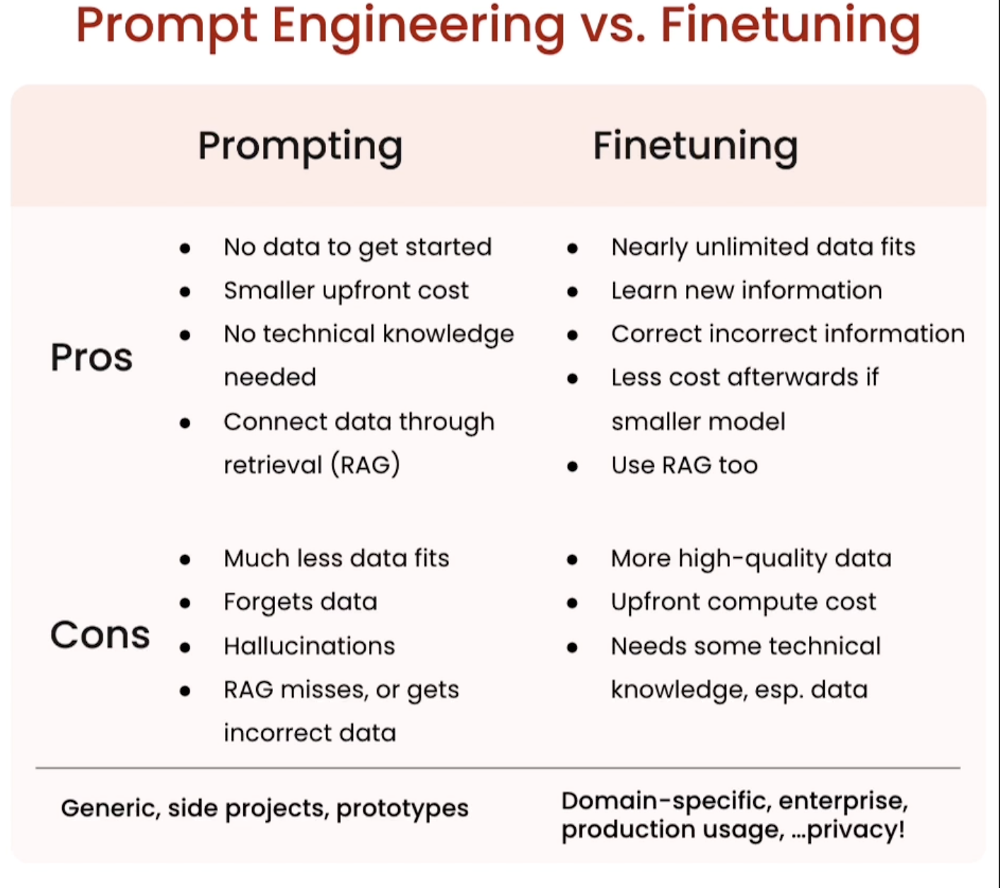
- **Introduction to Fine-Tuning**: Understanding the basics and benefits of fine-tuning LLMs.
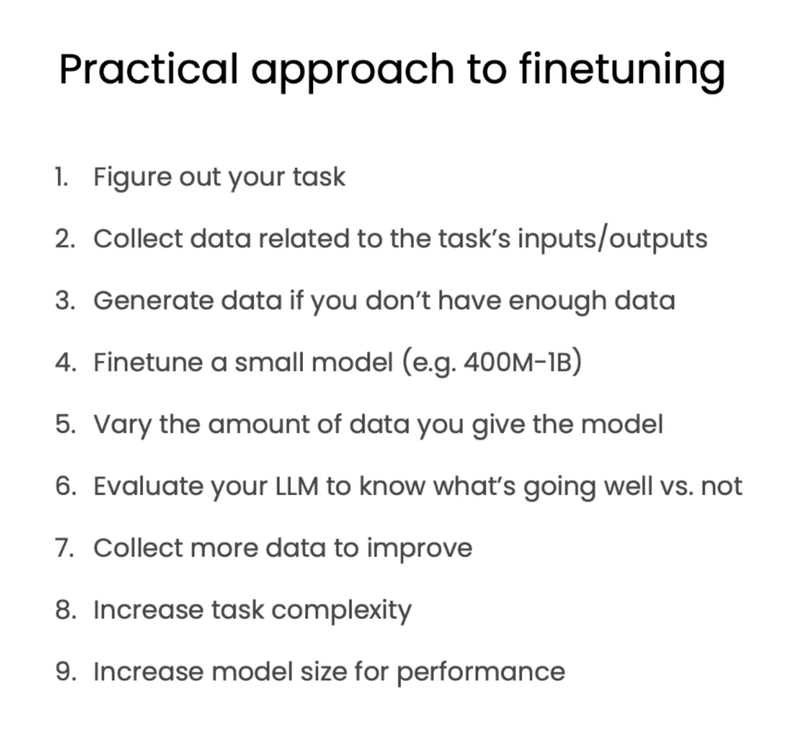
- **Approach to Fine-Tuning**: Different strategies and methodologies for fine-tuning.
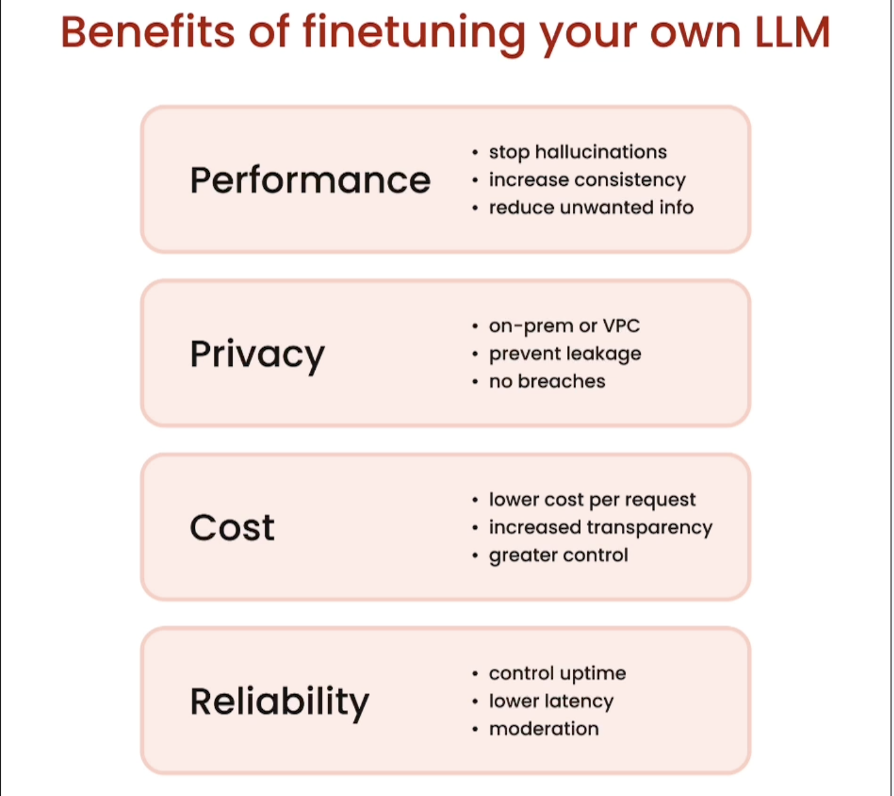
- **Benefits of Fine-Tuning**: How fine-tuning can improve model performance and adaptability.
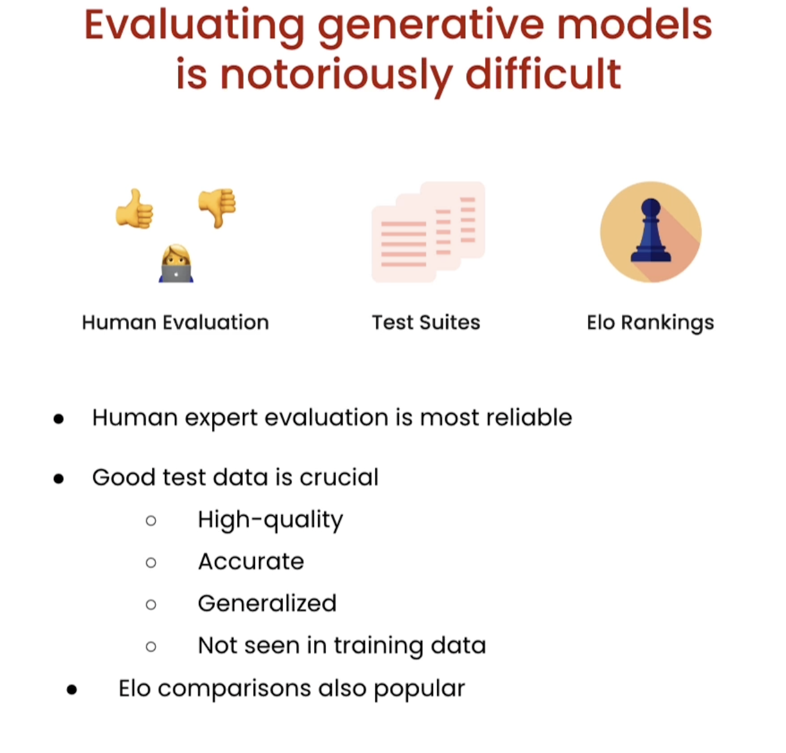
- **Evaluating Fine-Tuned Models**: Techniques for assessing the performance of fine-tuned models.
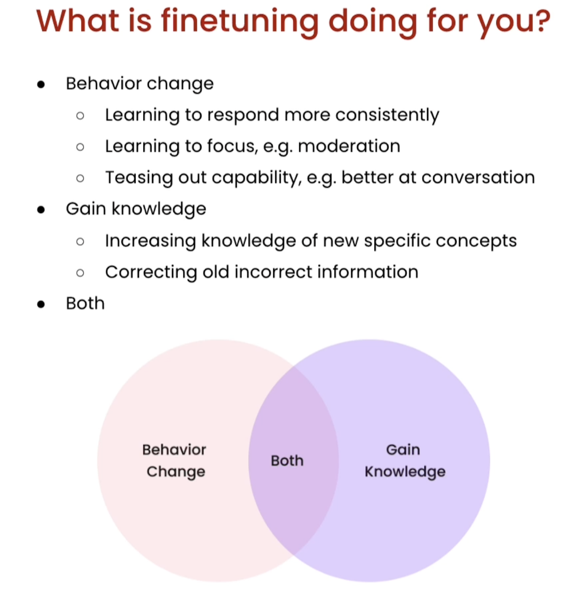
- **Types of Fine-Tuning**: Overview of various fine-tuning methods, including LoRA and PEFT.
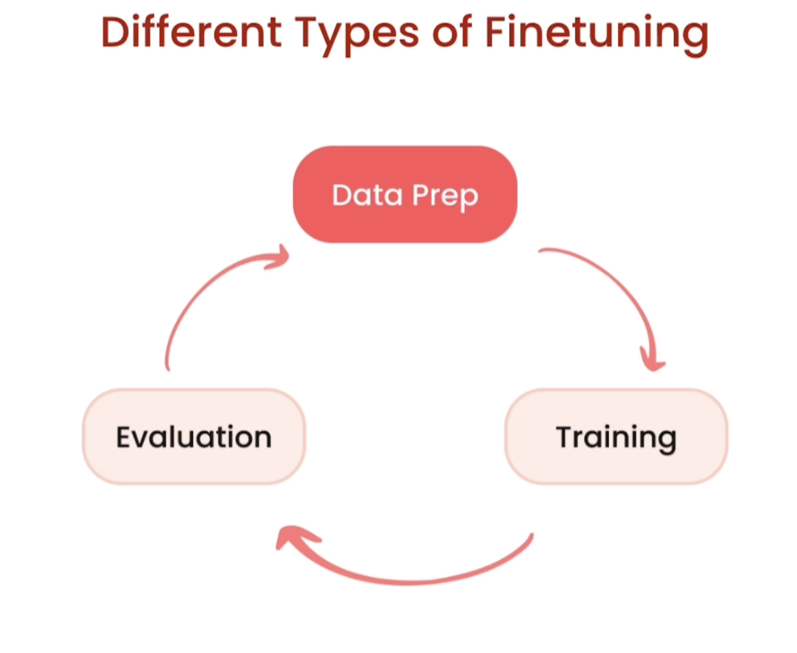
- **First-Time Fine-Tuning**: A beginner's guide to starting with fine-tuning.
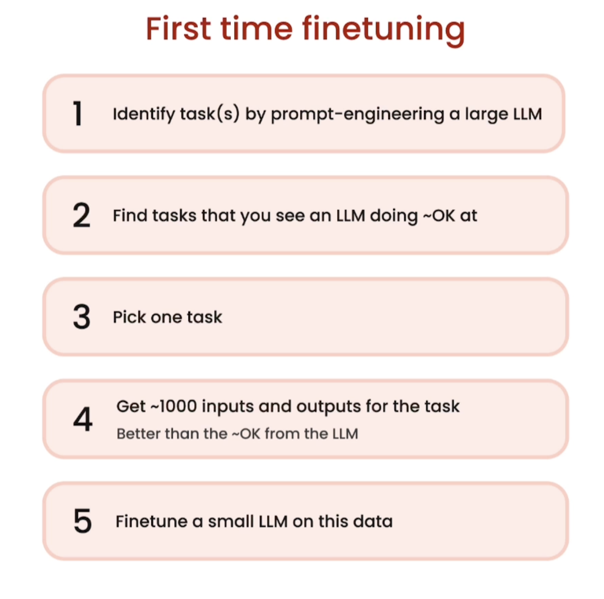
- **Data Preparation for Fine-Tuning**: Best practices for preparing datasets for fine-tuning.
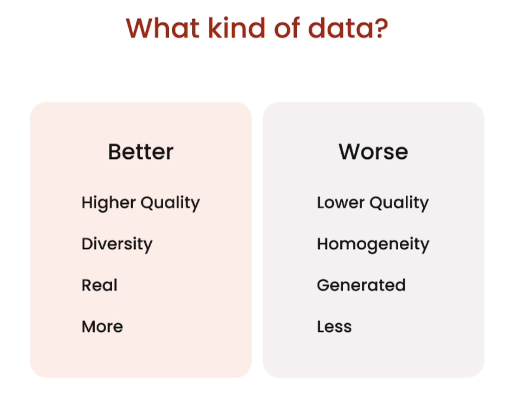
- **LoRA and PEFT**: Introduction to Low-Rank Adaptation (LoRA) and Parameter-Efficient Fine-Tuning (PEFT).
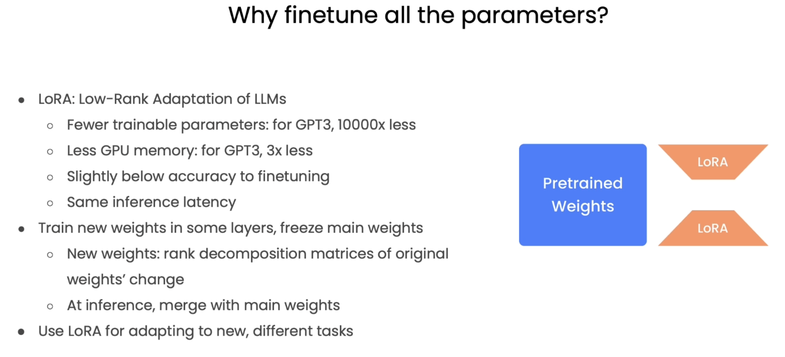
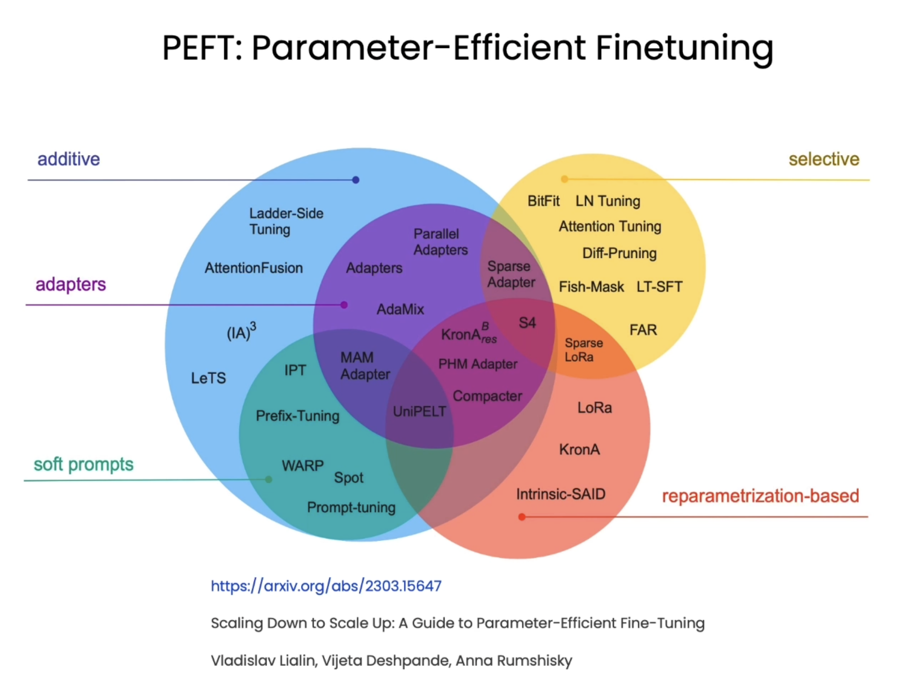
- **Preparation of Data for Fine-Tuning**: Steps to prepare your data effectively.
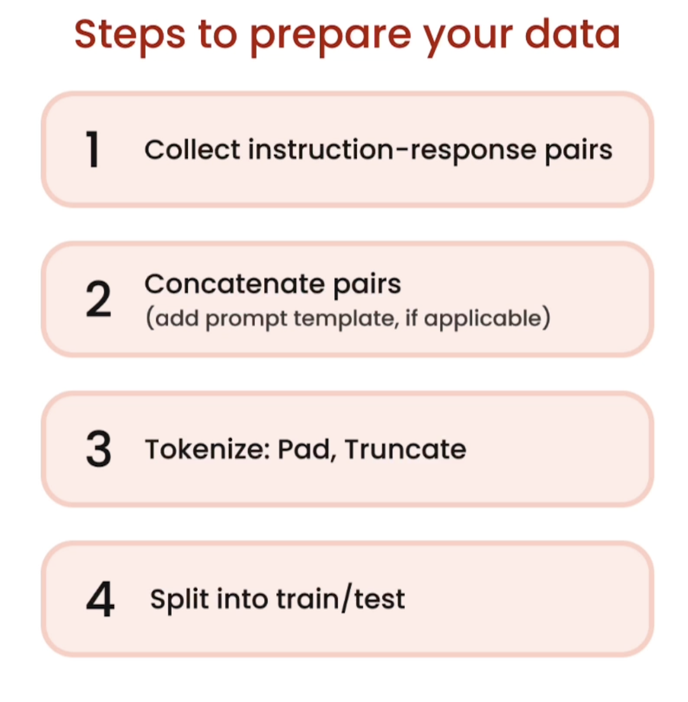

## Features

- Step-by-step instructions for LLM fine-tuning
- Example scripts for popular frameworks (PyTorch, Hugging Face Transformers)
- Best practices for dataset preparation and evaluation
- Tips for optimizing training and reducing costs

## Getting Started

1. Clone the repository:
   ```bash
   git clone https://github.com/yourusername/Complete-LLM-Fine-Tuning.git
   cd Complete-LLM-Fine-Tuning
   ```

2. Follow the tutorials in the `notebooks/` directory.

## Folder Structure

- `notebooks/` — Interactive tutorials and walkthroughs
- `assets/` — Images and diagrams used in the tutorials

## Contributing

Contributions are welcome! Please open an issue or submit a pull request.

## License

This project is licensed under the MIT License.
See the [LICENSE](LICENSE) file for details.